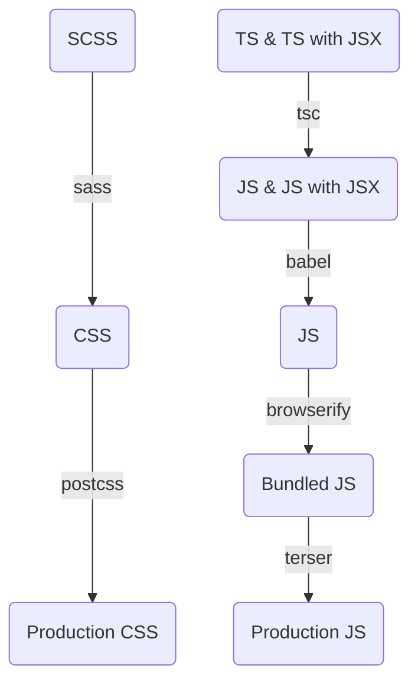

# メカトロニクス研究部会
仙台高専名取キャンパスで活動しているメカトロニクス研究部会の[ホームページ](https://mecha-natori.github.io/)のソースです。  
主に新人向けの講習資料などを公開します。

## 概要
### 動作環境
- [React 18.2.0](https://unpkg.com/browse/react@18.2.0)
  - [ReactDOM 18.2.0](https://unpkg.com/browse/react-dom@18.2.0)
  - [Helmet-async 1.3.0](https://cdn.jsdelivr.net/npm/react-helmet-async@1.3.0/)
  - [RouterDOM 6.8.1](https://unpkg.com/browse/react-router-dom@6.8.1)
- Bootstrap 5.2.3 ([CSS](https://cdn.jsdelivr.net/npm/bootstrap@5.2.3/)・[JS](https://cdn.jsdelivr.net/npm/bootstrap@5.2.3/))
  - [Bootstrap Icons 1.10.3](https://cdn.jsdelivr.net/npm/bootstrap-icons@1.10.3/)
### ビルド環境
- [Node.js](https://nodejs.org/ja)
- [Babel](https://www.npmjs.com/package/babel)
- [ESLint](https://www.npmjs.com/package/eslint)
  - config
    - [eslint](https://www.npmjs.com/package/eslint-config-eslint)
    - [standard](https://www.npmjs.com/package/eslint-config-standard)
    - [standard-jsx](https://www.npmjs.com/package/eslint-config-standard-jsx)
  - import-resolver
    - [typescript](https://www.npmjs.com/package/eslint-import-resolver-typescript)
  - parser
    - [typescript-eslint](https://www.npmjs.com/package/@typescript-eslint/parser)
  - plugin
    - [etc](https://www.npmjs.com/package/eslint-plugin-etc)
    - [functional](https://www.npmjs.com/package/eslint-plugin-functional)
    - [import](https://www.npmjs.com/package/eslint-plugin-import)
    - [jsdoc](https://www.npmjs.com/package/eslint-plugin-jsdoc)
    - [jsx-a11y](https://www.npmjs.com/package/eslint-plugin-jsx-a11y)
    - [n](https://www.npmjs.com/package/eslint-plugin-n)
    - [promise](https://www.npmjs.com/package/eslint-plugin-promise)
    - [react](https://www.npmjs.com/package/eslint-plugin-react)
    - [react-hooks](https://www.npmjs.com/package/eslint-plugin-react-hooks)
    - [rxjs](https://www.npmjs.com/package/eslint-plugin-rxjs)
    - [typescript-eslint](https://www.npmjs.com/package/@typescript-eslint/eslint-plugin)
- [PostCSS](https://www.npmjs.com/package/postcss)
  - [Autoprefixer](https://www.npmjs.com/package/autoprefixer)
  - [cssnano](https://www.npmjs.com/package/cssnano)
- [React](https://www.npmjs.com/package/react)
  - [ReactDOM](https://www.npmjs.com/package/react-dom)
  - [Helmet](https://www.npmjs.com/package/react-helmet)
  - [Router](https://www.npmjs.com/package/react-router)
    - [RouterDOM](https://www.npmjs.com/package/react-router-dom)
- [Sass](https://www.npmjs.com/package/sass)
- [styled-jsx](https://www.npmjs.com/package/styled-jsx)
- [Terser](https://www.npmjs.com/package/terser)
- [TypeScript](https://www.npmjs.com/package/typescript)

## 業務連絡
### ページ追加方法
1. `/src/pages`配下にページコンポーネントを作成
2. `/src/pages/index.tsx`でexportさせる
3. `/src/App.tsx`にルーティングを追加する
