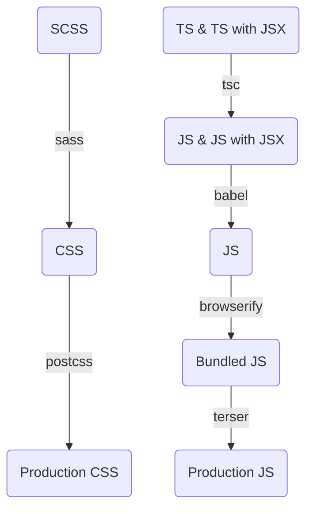

# メカトロニクス研究部会
仙台高専名取キャンパスで活動しているメカトロニクス研究部会の[ホームページ](https://mecha-natori.github.io/)のソースです。  
主に新人向けの講習資料などを公開します。

## 概要
### 動作環境
- [React 18.2.0](https://unpkg.com/browse/react@18.2.0/umd/react.development.js)
  - [ReactDOM 18.2.0](https://unpkg.com/browse/react-dom@18.2.0/umd/react-dom.development.js)
  - [Helmet 6.1.0](https://cdn.jsdelivr.net/npm/react-helmet@6.1.0/lib/Helmet.js)
  - [RouterDOM 6.8.1](https://unpkg.com/browse/react-router-dom@6.8.1/dist/umd/react-router-dom.development.js)
- Bootstrap 5.2.3 ([CSS](https://cdn.jsdelivr.net/npm/bootstrap@5.2.3/dist/css/bootstrap.css)・[JS](https://cdn.jsdelivr.net/npm/bootstrap@5.2.3/dist/js/bootstrap.bundle.js))
  - [Bootstrap Icons 1.10.3](https://cdn.jsdelivr.net/npm/bootstrap-icons@1.10.3/font/bootstrap-icons.css)
### ビルド環境
- [Node.js 19.6.1](https://nodejs.org/ja)
- [Babel 7.21.0](https://www.npmjs.com/package/babel/v/7.21.0)
- [ESLint 8.34.0](https://www.npmjs.com/package/eslint/v/8.34.0)
  - config
    - [eslint 7.0.0](https://www.npmjs.com/package/eslint-config-eslint/v/7.0.0)
    - [standard 17.0.0](https://www.npmjs.com/package/eslint-config-standard/v/17.0.0)
    - [standard-jsx 11.0.0](https://www.npmjs.com/package/eslint-config-standard-jsx/v/11.0.0)
  - import-resolver
    - [typescript 3.5.3](https://www.npmjs.com/package/eslint-import-resolver-typescript/v/3.5.3)
  - parser
    - [typescript-eslint 5.53.0](https://www.npmjs.com/package/@typescript-eslint/parser/v/5.53.0)
  - plugin
    - [etc 2.0.2](https://www.npmjs.com/package/eslint-plugin-etc/v/2.0.2)
    - [functional 5.0.4](https://www.npmjs.com/package/eslint-plugin-functional/v/5.0.4)
    - [import 2.27.5](https://www.npmjs.com/package/eslint-plugin-import/v/2.27.5)
    - [jsdoc 40.0.0](https://www.npmjs.com/package/eslint-plugin-jsdoc/v/40.0.0)
    - [jsx-a11y 6.7.1](https://www.npmjs.com/package/eslint-plugin-jsx-a11y/v/6.7.1)
    - [n 15.6.1](https://www.npmjs.com/package/eslint-plugin-n/v/15.6.1)
    - [promise 6.1.1](https://www.npmjs.com/package/eslint-plugin-promise/v/6.1.1)
    - [react 7.32.2](https://www.npmjs.com/package/eslint-plugin-react/v/7.32.2)
    - [react-hooks 4.6.0](https://www.npmjs.com/package/eslint-plugin-react-hooks/v/4.6.0)
    - [rxjs 5.0.2](https://www.npmjs.com/package/eslint-plugin-rxjs/v/5.0.2)
    - [typescript-eslint 5.53.0](https://www.npmjs.com/package/@typescript-eslint/eslint-plugin/v/5.53.0)
- [PostCSS 8.4.21](https://www.npmjs.com/package/postcss/v/8.4.21)
  - [Autoprefixer 10.4.13](https://www.npmjs.com/package/autoprefixer/v/10.4.13)
  - [cssnano 5.1.15](https://www.npmjs.com/package/cssnano/v/5.1.15)
- [React 18.2.0](https://www.npmjs.com/package/react/v/18.2.0)
  - [ReactDOM 18.2.0](https://www.npmjs.com/package/react-dom/v/18.2.0)
  - [Helmet 6.1.0](https://www.npmjs.com/package/react-helmet/v/6.1.0)
  - [Router 6.8.1](https://www.npmjs.com/package/react-router/v/6.8.1)
    - [RouterDOM 6.8.1](https://www.npmjs.com/package/react-router-dom/v/6.8.1)
- [Sass 1.58.3](https://www.npmjs.com/package/sass/v/1.58.3)
- [Terser 5.16.4](https://www.npmjs.com/package/terser/v/5.16.4)
- [TypeScript 4.9.5](https://www.npmjs.com/package/typescript/v/4.9.5)

